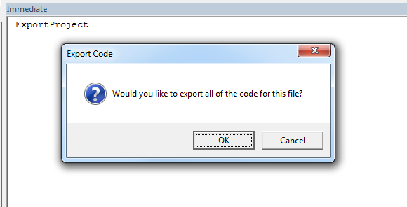

# Excel Code Export

An Add-In that exports individual module, class, form and XML ribbon files so they can be added/diffed in source control. The only version is currently in VBA.

* Tested on Windows 7 / Excel 2016

<h1 align="left">
  
</h1>
